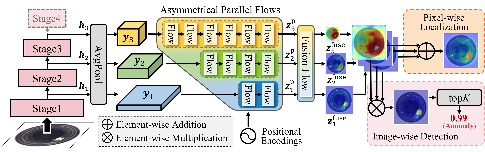

# MSFlow: Multi-Scale Normalizing Flows for Unsupervised Anomaly Detection

This is an official implementation of "[MSFlow: Multi-Scale Normalizing Flows for Unsupervised Anomaly Detection](https://arxiv.org/pdf/2308.15300v1.pdf)".
[](https://paperswithcode.com/sota/anomaly-detection-on-mvtec-ad?p=msflow-multi-scale-flow-based-framework-for)

## Abstract

Unsupervised anomaly detection (UAD) attracts a lot of research interest and drives widespread applications, where only anomaly-free samples are available for training. Some UAD applications intend to locate the anomalous regions further even without any anomaly information. Although the absence of anomalous samples and annotations deteriorates the UAD performance, an inconspicuous yet powerful statistics model, the normalizing flows, is appropriate for anomaly detection and localization in an unsupervised fashion. The flow-based probabilistic models, only trained on anomaly-free data, can efficiently distinguish unpredictable anomalies by assigning them much lower likelihoods than normal data. Nevertheless, the size variation of unpredictable anomalies introduces another inconvenience to the flow-based methods for high-precision anomaly detection and localization. To generalize the anomaly size variation, we propose a novel **M**ulti-**S**cale **Flow**s-based framework dubbed **MSFlow** composed of asymmetrical parallel flows followed by a fusion flow to exchange multi-scale perceptions. Moreover, different multi-scale aggregation strategies are adopted for the image-wise anomaly detection and pixel-wise anomaly localization according to the discrepancy between them. On the challenging MVTec AD benchmark, our MSFlow achieves a new state-of-the-art with detection AUORC score of 99.7%, localization AUROC score of 98.8% and PRO score of 97.1%.



## Enviroment

- Python 3.9
- scikit-learn
- scikit-image
- PyTorch >= 1.10
- CUDA 11.3
- [FrEIA](https://github.com/VLL-HD/FrEIA) (Please install FrEIA following the [official installation](https://github.com/VLL-HD/FrEIA#table-of-contents))

## Prepare datasets

It is recommended to symlink the dataset root to `$msflow/data`.
If your folder structure is different, you may need to change the corresponding paths in `default.py`.

**For MVTec AD data**, please download from [MVTec AD download](https://www.mvtec.com/company/research/datasets/mvtec-ad). Download and extract them to `$msflow/data`, and make them look like the following data tree:

```shell
MVTec
|-- bottle
|-----|----- ground_truth
|-----|----- test
|-----|--------|------ good
|-----|--------|------ broken_large
|-----|--------|------ ...
|-----|----- train
|-----|--------|------ good
|-- cable
|-- ...
```

## Training and Testing

All checkpoints will be saved to the working directory, which is specified by `work_dir` in the `default` file.

By default, we evaluate the model on the test set after each meta epoch, you can change the pro evaluation interval by modifying the interval argument in the shell or `default` file.

### Training

```shell
python main.py --mode train --gpu 0 --class-name bottle --pro-eval
```

### Testing

```shell
python main.py --mode test --gpu 0 --eavl_ckpt --class-name bottle
```


## Results on the MVTec AD benchmark

| Classes             | Det. AUROC | Loc. AUROC |
| ------------------- | :--------: | :--------: |
| Carpet              |   100.0    |    99.4    |
| Grid                |    99.8    |    99.4    |
| Leather             |   100.0    |    99.7    |
| Tile                |   100.0    |    98.2    |
| Wood                |   100.0    |    97.1    |
| Bottle              |   100.0    |    99.0    |
| Cable               |    99.5    |    98.5    |
| Capsule             |    99.2    |    99.1    |
| Hazelnut            |   100.0    |    98.7    |
| Metal Nut           |   100.0    |    99.3    |
| Pill                |    99.6    |    98.8    |
| Screw               |    97.8    |    99.1    |
| Toothbrush          |   100.0    |    98.5    |
| Transistor          |   100.0    |    98.3    |
| Zipper              |   100.0    |    99.2    |
| **Overall Average** |  **99.7**  |  **98.8**  |

## Thanks to

- [FrEIA](https://github.com/VLL-HD/FrEIA)
- [CFlow-AD](https://github.com/gudovskiy/cflow-ad)
- [CSFlow](https://github.com/marco-rudolph/cs-flow)
